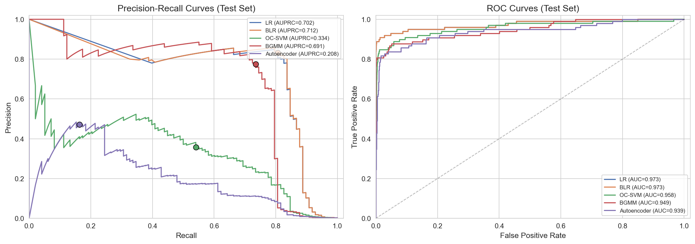

# EE4685 Assignment 2: Credit Card Fraud Detection

Bayesian vs non-Bayesian comparison across supervised and anomaly detection approaches.

**Authors:** Adam El Haddouchi (5476526) & Naufal El Khatibi (5315778)

**Course:** EE4685 Bayesian Machine Learning, TU Delft, Q3 2025-2026

## Overview

Credit card fraud detection is a binary classification problem with extreme class imbalance: only 0.172% of transactions in the dataset are fraudulent. Standard models output point predictions, but a fraud analyst also needs to know how confident the model is. Bayesian models can provide this confidence estimate, which opens up different operational decisions.

We compare five models arranged in a 2x2 design crossing {supervised, anomaly detection} with {Bayesian, non-Bayesian}, plus an autoencoder as a fifth model. The supervised pair (Logistic Regression vs. Bayesian Logistic Regression) shares the same likelihood and differs only in inference method. The anomaly detection pair (One-Class SVM vs. Bayesian Gaussian Mixture Model) shares the same training data (normal transactions only). This design controls for confounding variables so that performance differences within a pair can be attributed to the Bayesian treatment.

The notebook markdown cells contain extended analysis beyond what the report covers, including intermediate results, visualizations, and discussion of modeling choices.

### Research Questions

1. **Does Bayesian inference add value over standard methods?** In the supervised setting, BLR matched LR on classification metrics but added uncertainty estimates that enable a three-bucket decision protocol (auto-approve, human review, auto-flag), auto-approving 92.6% of transactions while maintaining 90.8% fraud coverage.

2. **How much does access to labeled fraud data help?** BGMM, trained without any fraud labels, achieved F1 = 0.754, competitive with the supervised models (F1 = 0.819). The choice of anomaly detection method matters more than having labeled data: OC-SVM achieved only F1 = 0.431 on the same data.

3. **Does nonlinear representation learning capture fraud structure that linear methods miss?** No. The autoencoder performed worst (F1 = 0.242), confirming that the PCA features already capture the relevant fraud geometry linearly.

## Dataset

We use the [Kaggle Credit Card Fraud Detection dataset](https://www.kaggle.com/datasets/mlg-ulb/creditcardfraud), created by the Machine Learning Group at Universite Libre de Bruxelles. It contains 284,807 transactions made by European cardholders over two days in September 2013, of which 492 (0.172%) are fraudulent. The imbalance ratio is about 577:1.

Features V1 through V28 are the result of a proprietary PCA transformation applied to the original transaction variables. The original feature space and the PCA rotation are unknown. The only untransformed features are `Time` (seconds since the first transaction) and `Amount` (transaction value in euros). The target variable `Class` is 1 for fraud and 0 for normal.

Key properties from exploratory analysis:
- `Amount` is heavily right-skewed (median 22 EUR vs. mean 88 EUR), with 0.64% of transactions at zero amount
- The most discriminative features are V17, V14, V12, and V10 (correlations with Class between -0.22 and -0.33)
- `Time` shows daily patterns but similar distributions across classes, with low value for classification

## Evaluation Strategy

The primary metric is **AUPRC** (Area Under the Precision-Recall Curve). Davis and Goadrich (2006) and Saito and Rehmsmeier (2015) showed that precision-recall curves are more informative than ROC curves for heavily skewed datasets. A trivial classifier predicting "normal" for every transaction achieves 99.83% accuracy while detecting zero fraud, so accuracy is meaningless here.

For threshold selection, we tune on the validation set by maximizing F1. The data is split into stratified 64/16/20 train/validation/test sets. A `StandardScaler` is fit on the training set only and applied to all splits. Supervised models use `class_weight='balanced'` rather than SMOTE to handle imbalance. Anomaly detection models train on normal transactions only (181,961 samples).

ROC-AUC is reported for completeness but all comparisons are based on AUPRC. We show in the results why ROC-AUC is actively misleading for this dataset.

## Repository Structure

```
cc-fraud-detection/
├── README.md
├── requirements.txt              # Direct dependencies
├── data/
│   └── creditcard.csv            # Dataset (not included, see below)
├── notebooks/
│   └── Notebook.ipynb            # Main analysis notebook
└── figures/                      # All generated plots
```

## Key Results

| Model | AUPRC | ROC-AUC | F1 | Precision | Recall | TP | FP | FN |
|-------|-------|---------|------|-----------|--------|---:|---:|---:|
| Logistic Regression | 0.702 | 0.973 | 0.819 | 0.832 | 0.806 | 79 | 16 | 19 |
| Bayesian Logistic Regression | 0.712 | 0.973 | 0.819 | 0.832 | 0.806 | 79 | 16 | 19 |
| Bayesian Gaussian Mixture | 0.691 | 0.949 | 0.754 | 0.774 | 0.735 | 72 | 21 | 26 |
| One-Class SVM | 0.334 | 0.958 | 0.431 | 0.358 | 0.541 | 53 | 95 | 45 |
| Autoencoder | 0.208 | 0.939 | 0.242 | 0.471 | 0.163 | 16 | 18 | 82 |

Test set: 56,962 transactions, 98 fraud cases. Thresholds tuned on the validation set by maximizing F1.

The results fall into three tiers: LR/BLR (Tier 1), BGMM (Tier 2), OC-SVM and Autoencoder (Tier 3). The PR curves show this separation clearly, while ROC-AUC compresses a 5x AUPRC range into a narrow 0.94-0.97 band, hiding meaningful differences.



Two contributions go beyond standard model comparison. First, we define a **Bayesian decision protocol** that uses BLR's per-prediction uncertainty to route transactions into auto-approve, human review, or auto-flag buckets. Second, we show with concrete numbers why **ROC-AUC is misleading** for this dataset: OC-SVM has higher ROC-AUC than BGMM (0.958 vs. 0.949) despite being far worse on every metric that matters to a fraud analyst.

## Reproducing the Results

**Python version:** 3.12.9

```bash
# 1. Clone the repository
git clone <repository-url>
cd cc-fraud-detection

# 2. Create and activate a virtual environment
python3 -m venv bml-project
source bml-project/bin/activate

# 3. Install dependencies
pip install -r requirements.txt

# 4. Download the dataset
# Go to https://www.kaggle.com/datasets/mlg-ulb/creditcardfraud
# Download creditcard.csv and place it in data/
mkdir -p data
# mv ~/Downloads/creditcard.csv data/

# 5. Open and run the notebook
jupyter notebook notebooks/Notebook.ipynb
```

The dataset is not included in the repository due to its size. Download it from the [Kaggle Credit Card Fraud Detection dataset](https://www.kaggle.com/datasets/mlg-ulb/creditcardfraud). Expected file: `data/creditcard.csv`, 284,807 rows, 31 columns (V1-V28, Time, Amount, Class).

`random_state=42` is used throughout for reproducibility. The full notebook runs in roughly 5-10 minutes depending on hardware (the OC-SVM and autoencoder training are the slowest steps).

## Models

| Model | Type | Role in comparison |
|-------|------|--------------------|
| **Logistic Regression (LR)** | Supervised, non-Bayesian | Baseline classifier with balanced class weights and L2 regularization |
| **Bayesian Logistic Regression (BLR)** | Supervised, Bayesian | Laplace approximation over LR weights; outputs predicted probability with uncertainty |
| **One-Class SVM (OC-SVM)** | Anomaly detection, non-Bayesian | RBF kernel boundary around normal data; anomaly score = signed distance to boundary |
| **Bayesian Gaussian Mixture (BGMM)** | Anomaly detection, Bayesian | Dirichlet process mixture of Gaussians; anomaly score = negative log-likelihood |
| **Autoencoder (AE)** | Anomaly detection, neural network | Symmetric feedforward network (30-14-7-14-30); anomaly score = reconstruction error |

## Future Work

- **Bayesian neural networks.** Extend uncertainty quantification to nonlinear models, for example using MC Dropout or variational inference over neural network weights.
- **Concept drift evaluation.** Test on datasets with temporal structure to see whether these findings hold when fraud patterns change over time.
- **Cost-sensitive thresholds.** Replace F1-optimal tuning with thresholds based on realistic fraud-to-false-alarm cost ratios, which would better reflect operational requirements.
- **Raw (non-PCA) features.** The proprietary PCA transformation may linearize the fraud signal. Evaluating on datasets with raw features would test whether the autoencoder's failure generalizes.
- **Sequential and behavioral features.** The current dataset contains only per-transaction features. Adding merchant history, device fingerprints, or spending patterns could improve separation between fraud and normal transactions.

## References

1. Bishop, C. M. (2006). *Pattern Recognition and Machine Learning*. Springer.
2. Bolton, R. J. and Hand, D. J. (2002). Statistical Fraud Detection: A Review. *Statistical Science*, 17(3), 235-255.
3. Chandola, V., Banerjee, A., and Kumar, V. (2009). Anomaly Detection: A Survey. *ACM Computing Surveys*, 41(3), 1-58.
4. Dal Pozzolo, A. (2015). *Adaptive Machine Learning for Credit Card Fraud Detection*. PhD thesis, Universite Libre de Bruxelles.
5. Dal Pozzolo, A., Caelen, O., Le Borgne, Y.-A., Waterschoot, S., and Bontempi, G. (2014). Learned Lessons in Credit Card Fraud Detection from a Practitioner Perspective. *Expert Systems with Applications*, 41(10), 4915-4928.
6. Dal Pozzolo, A., Boracchi, G., Caelen, O., Alippi, C., and Bontempi, G. (2017). Credit Card Fraud Detection: A Realistic Modeling and a Novel Learning Strategy. *IEEE Transactions on Neural Networks and Learning Systems*, 29(8), 3784-3797.
7. Davis, J. and Goadrich, M. (2006). The Relationship Between Precision-Recall and ROC Curves. *Proceedings of the 23rd International Conference on Machine Learning*, 233-240.
8. Elkan, C. (2001). The Foundations of Cost-Sensitive Learning. *Proceedings of the 17th International Joint Conference on Artificial Intelligence*, 973-978.
9. Rosley, A. A., Wan Ahmad, W. A., and Lim, K. H. (2022). Autoencoder-Based Anomaly Detection for Credit Card Fraud. *Journal of Computational Science*.
10. Saito, T. and Rehmsmeier, M. (2015). The Precision-Recall Plot Is More Informative than the ROC Plot When Evaluating Binary Classifiers on Imbalanced Datasets. *PLoS ONE*, 10(3), e0118432.
11. Scholkopf, B., Platt, J. C., Shawe-Taylor, J., Smola, A. J., and Williamson, R. C. (2001). Estimating the Support of a High-Dimensional Distribution. *Neural Computation*, 13(7), 1443-1471.
12. Westland, J. C. (2022). A Comparison of Bayesian and Frequentist Approaches to E-commerce Fraud Detection. *Journal of Electronic Business & Digital Economics*.
